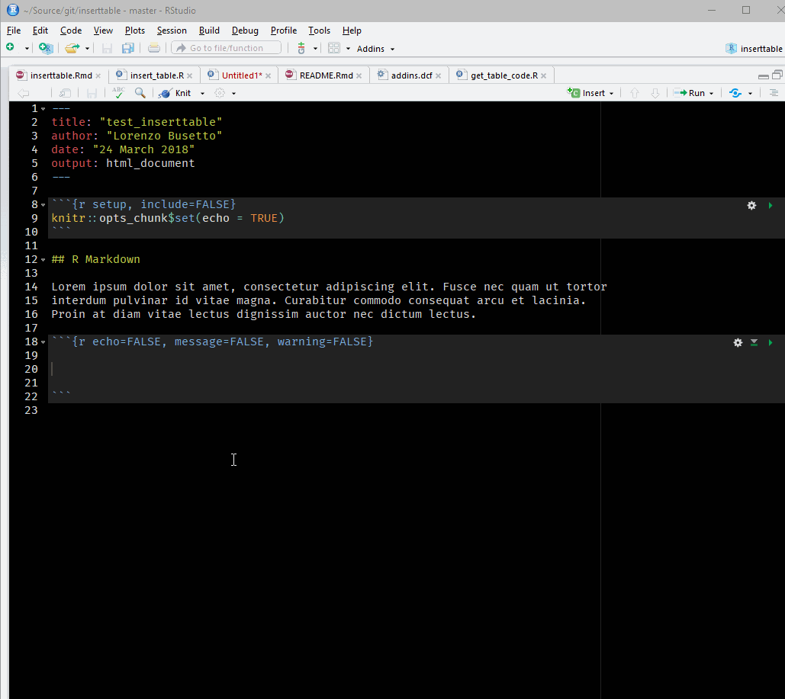
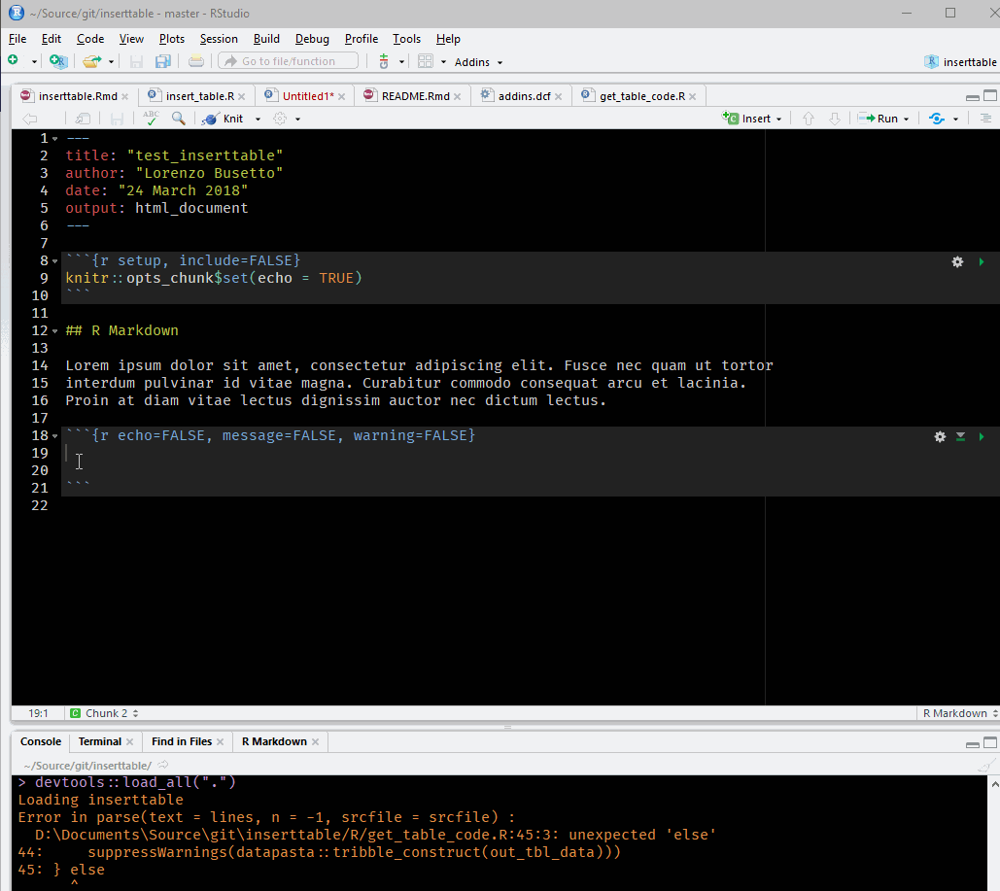
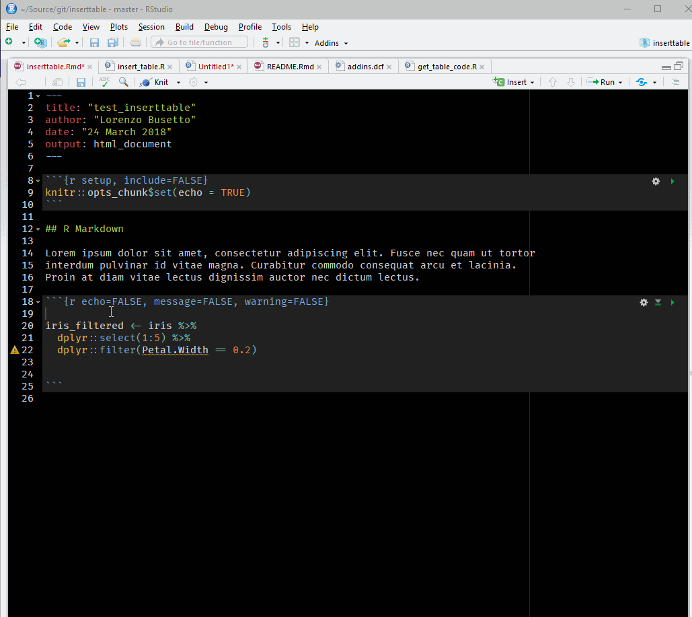

# inserttable

`inserttable` is an RStudio add-in facilitating insertion of nicely
formatted tables in R markdown documents or plain R scripts.

## Installation

You can install `inserttable` from
[GitHub](https://github.com/lbusett/insert_table) with:

``` r
# install.packages("devtools")
devtools::install_github("lbusett/insert_table")
```

## Usage

Upon installing, `inserttable` registers a new RStudio Addin (**Insert
Table**) that can be used to easily insert a table in a `Rmd` document.
To use it, open a `Rmd` document and, with the cursor within a `r` chunk
and select “Addins –\> Insert Table”.

These are the two main **use modes**:

### Launch the addin with the cursor on a empty line

In this case, a GUI will open allowing you to **select the desired
output format** ( `kableExtra`, `DT` and `rhandsontable` are currently
implemented), and to **edit the content of the table**. After clicking
**Done** the Addin will add in the file the code needed to generate the
table in a nice `tribble` format (thanks to Miles McBain’s
[`datapasta`](https://github.com/milesmcbain/datapasta) package\!) to
allow easier additional editing, and also the code needed to render it
with the selected output format using some default options, as can be
seen below:

**IMPORTANT NOTE:** Not all output formats play well with knitting to
PDF or Word\!. `kable` works everywhere, while `DT` and `rhandsontable`
work out of the box only if knitting to html. You can make them work on
PDF and Word by adding `always_allow_html: yes` in the yaml header of
the Rmd, and installing **phantomjs** using:
`webshot::install_phantomjs()` (results are not that good, though).



A useful feature is that, for larger tables, you can also **cut and
paste content from a spreadsheet** :



Obviously, rendering of the table can be tweaked further by
changing/adding arguments of the rendering functions in the
automatically generated code.

### Launch the addin while selecting the name of a variable

In this case, the GUI allows you to select **only the desired output
format** ( it is assumed that the variable you select corresponds to a
`data frame` or similar object containing the data you wish to show as
table). After clicking **Done** the Addin will add in the `Rmd` document
the code needed to render the selected variable as a table with the
selected output format. The code will be added at the first empty line
below that containing the name of the selected variable.



**IMPORTANT NOTE**: `inserttable` will make no effort to guarantee that
the variable you select is a `data.frame`. It is up to you to select a
meaningful variable\!

## Usage from the console

You can also use (part of) `inserttable` functionality from the console
by calling function `insert_table()`.

``` r

> insert_table(tbl_name = "table_1", nrows = 4, ncols = 4, tbl_format = "DT")
```

The function will return **to the console** the code needed to create a
empty table of the specified dimensions and render it with the selected
format:


